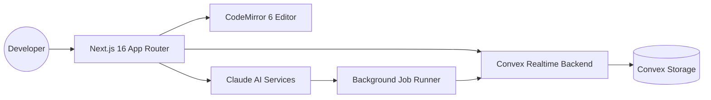
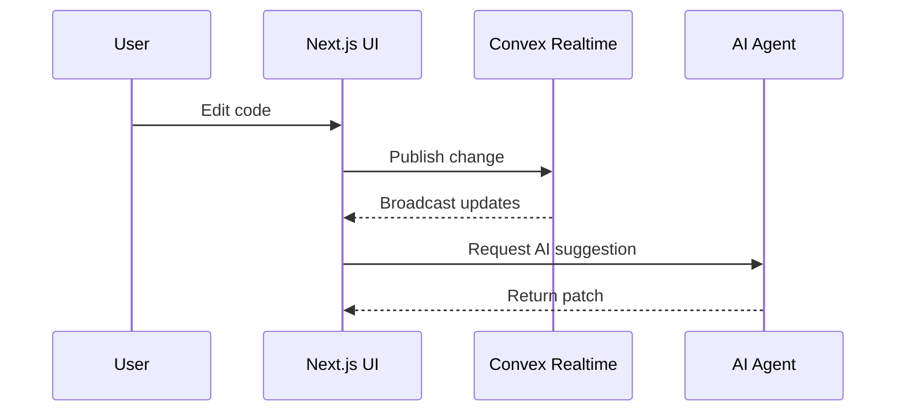

<div align="center">
	<h1>Polaris</h1>
	<p><strong>AI-powered, real-time code editor built for professional workflows.</strong></p>
	<p>
		
		
		
		
		
		
	</p>
</div>

**Polaris** is a full-featured, AI-powered real-time code editor built from the ground up. It delivers a professional developer experience with a CodeMirror 6 editor (syntax highlighting, code folding, minimap), AI-powered code suggestions and quick edits using Claude, and background job execution for AI agents.

Built on **Next.js 16**, **Convex** for real-time data, and modern performance-first architecture.

---

## ✨ Highlights

- **Real-time collaboration** with low-latency updates powered by Convex.
- **Pro-grade editor**: CodeMirror 6 with syntax highlighting, folding, minimap, and extensible plugins.
- **AI assistance**: Claude-backed suggestions, quick edits, and background agent jobs.
- **Performance-focused**: streaming UI, edge-friendly design, and optimized rendering paths.
- **Modern stack**: Next.js App Router, TypeScript, Tailwind UI components, and scalable architecture.

---

## 🧭 Product Overview

Polaris is designed as a professional DE that feels instant and intelligent. The editor is the core, but the platform layers in AI workflows, real-time collaboration, and job orchestration to support serious developer use cases.

### Core Capabilities

- **Editor UX**: custom commands, rich keyboard workflow, and multi-pane layout.
- **AI workflows**: contextual suggestions, rewrite/quick edit, and agent-driven tasks.
- **Real-time data**: presence, collaborative updates, and low-latency syncing.
- **Scalable architecture**: background jobs and asynchronous workflows for agent execution.

---

## 🧩 Architecture



### Data & Collaboration Flow



---

## ⚙️ Tech Stack

<p>
	
</p>

- **Frontend**: Next.js 16 (App Router), React, TypeScript
- **Editor**: CodeMirror 6
- **Realtime**: Convex
- **UI**: Tailwind CSS + component library
- **AI**: Claude for suggestions and quick edits
- **Infra**: Modern performance-first patterns, background jobs

---

## 🚀 Getting Started

### Prerequisites

- Node.js 18+
- pnpm / npm / yarn / bun
- Convex account + deployed project

### Installation

```bash
git clone <your-repo-url>
cd cursor-clone
```

```bash
npm install
```

### Environment Variables

Create a `.env.local` with your required environment variables (Convex + AI keys). Example:

```bash
CONVEX_DEPLOYMENT=
NEXT_PUBLIC_CONVEX_URL=
CLAUDE_API_KEY=
```

### Run the App

```bash
npm run dev
```

Open http://localhost:3000 to view the application.

---

## 🧪 Quality & Performance

- **Real-time latency budget** optimized via Convex subscriptions.
- **Streaming UI** for large documents and AI responses.
- **Background jobs** for non-blocking AI agent work.
- **Typed end-to-end** for reliability in real-time workflows.

---

## 📁 Project Structure (High Level)

- `app/` – Next.js App Router pages and layouts
- `components/` – UI components and shared building blocks
- `convex/` – Realtime functions, schema, and backend logic
- `hooks/` – Client hooks and runtime helpers
- `lib/` – Utilities and shared helpers

---

## 🧑‍💻 Contributing

We welcome contributions from developers who want to enhance the experience of Polaris.

1. Fork the repo
2. Create a feature branch
3. Commit changes with clear messages
4. Open a pull request

---

## 📜 License

This project is licensed under the MIT License.

---

## 🔒 Security

If you discover a security issue, please report it privately and responsibly.

---

## 📬 Contact

For business or partnership inquiries, open an issue or contact the maintainer.
